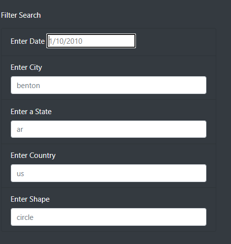
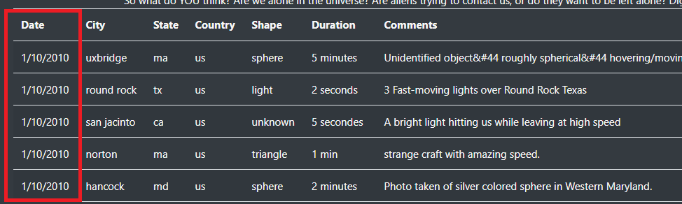
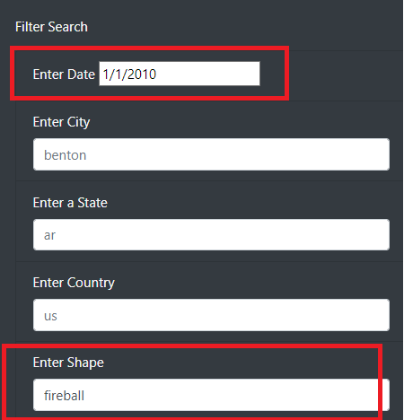

## UFO Sightings Project

# Overview of the analysis: 
Purpose of the project is to create a wepage that houses UFO sighting data that is available to users to search through the data. The webpage will allow users to utlize multiple search criteria such as dates, city, state and country.

# Results: 
The website has a tool for users to search using multiple criteria. The user will utilize the search bars to the left of the webpage and input the criteria. 

If the user is looking for UFO sightings for specific date, for example 1/10/2010, they can enter a date and the results would display to the right of the search bars. 

However, if the user wants to search using multiple criteria they would input more data. For example, if the user is looking for the specific fireball shape on 1/1/2010, the user can simply enter those values into the search bars for those categories. See image below. 

 

The results would return as entered. See image below.

# Summary: 
Overall the tool is useful for narrowing searches with the multiple search criteria, however applying to many criteria can limit the results. 

One recommendation is allowing the user to apply filters directly on the search results. This will allow the member to search by one criteria and see the total volume of UFO sightings around the world then apply a sub filter to narrow down their search more.

Another recommendation would be to add visualizations. For example, a map or bar charts, to view where sightings are and volume of sightings in specific areas.  
